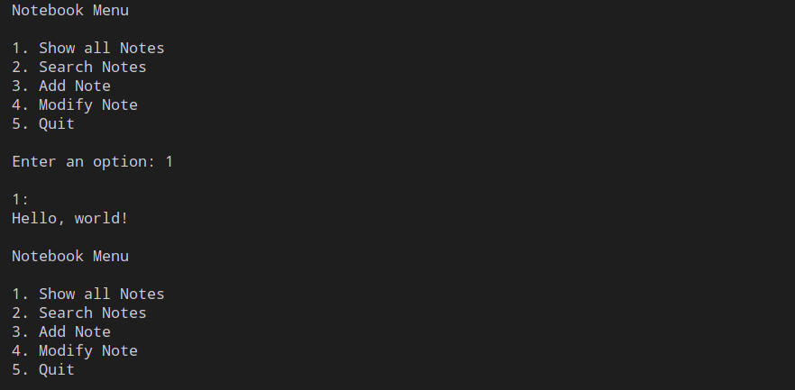

# Notebook

This is a code example taken from 'Python 3 Object-Orieted Programming' by Dusty Philips.

Module 'notebook.py' has classes that represent a notebook: Note and Notebook.

## Example of usage

Adding new note

